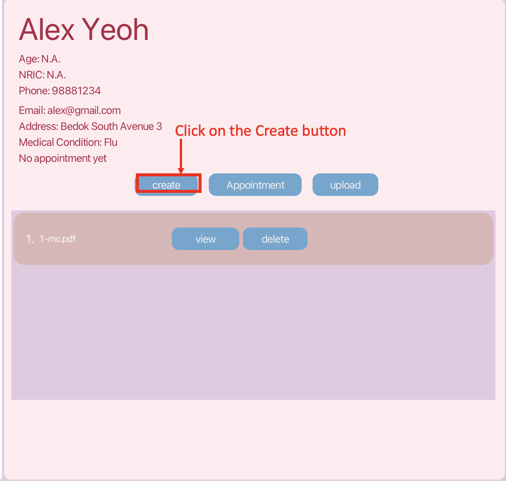
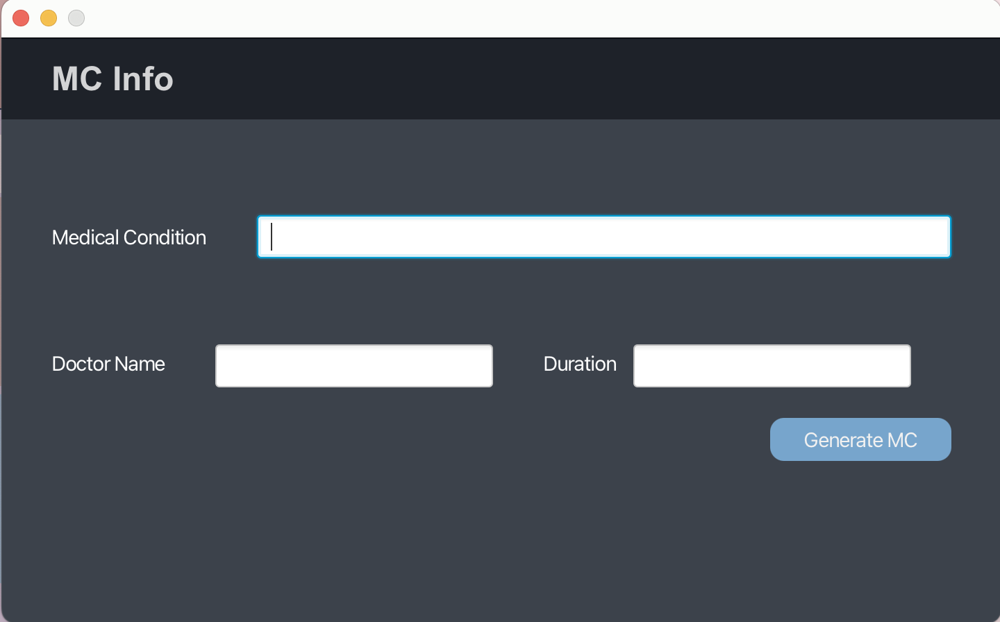
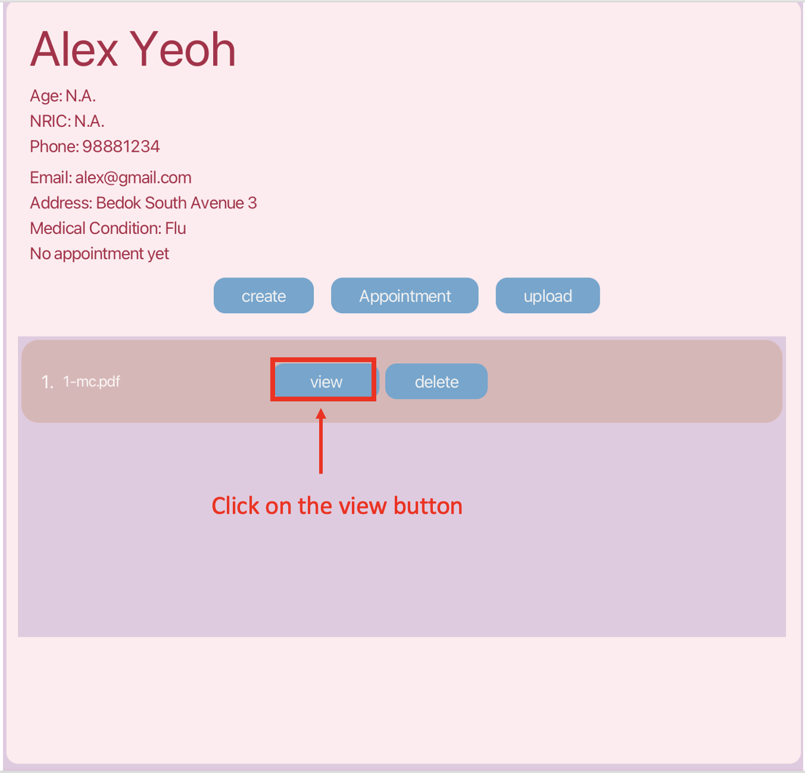
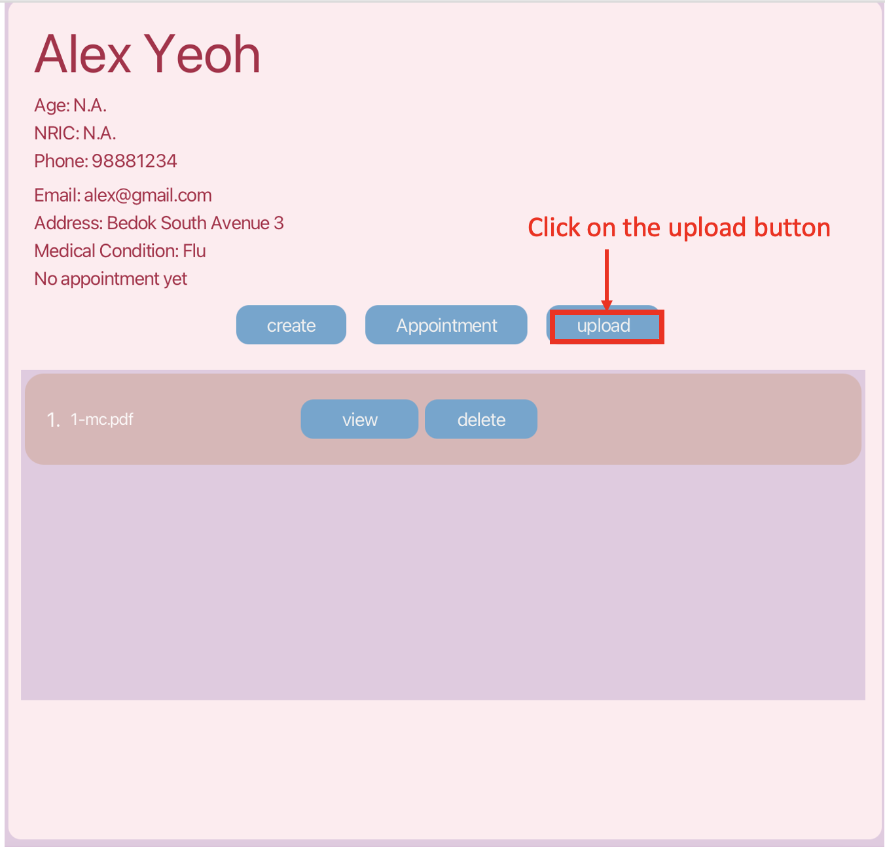

MediMate (MM) is a cross-platform desktop application designed to help medical professionals efficiently manage patient data.
Whether you currently use paper records, electronic records, or other applications to store patient information,
MM provides an effective solution for updating, accessing, and adding new patient details easily.

MM is intended for medical professionals who possess basic computer skills, such as the ability to navigate through folders and files
on a computer, use a keyboard and mouse, open and close applications, and enter data into forms and fields.
The user interface of MM has been designed to be intuitive and easy to navigate,
accommodating users with varying levels of computer proficiency.

MM is cross-platform compatible, which means that it can be used on different operating systems such as Windows, Mac, or Linux,
allowing users to access their patient data from any device they choose.
By using MM, medical professionals can manage patient data more efficiently and effectively, which can lead to better patient outcomes.

## Table of Contents

- [Quick Start](#Quick-Start)
- [Features](#features)
  - [Help](#Help)
  - [Add a patient](#add-a-patient--add)
  - [List all patients](#listing-all-patients--list)
    - [List patients in alphabetical order](#listing-patients-in-alphabetical-order--list_name)
  - [Show](#show-a-patients-information-show)
  - [Edit a patient](#editing-a-patient--edit)
  - [Appointment](#appointment)
    - [Make or change an appointment](#making-appointment-to-a-patient--makeapp)
    - [Mark an appointment](#marking-appointment-with-a-patient-markapp)
  - [Create a medical certificate for patient](#create-a-medical-certificate-for-patient-create)
  - [View a medical file](#view-the-medical-file-of-a-patient-view)
  - [Upload a medical file](#upload-a-patients-medical-file-upload)
  - [Find a patient](#locating-patients-by-name--find)
  - [Search Appointment date](#searching-patients-with-appointment-on-specified-date-searchdate)
  - [Delete](#deleting-a-patient--delete)
    - [Deletes multiple patients](#deleting-multiple-patients--deletes)
    - [Delete a medical file](#delete-a-medical-file-for-the-specified-patient-deletefile)
  - [Clear](#clearing-all-entries--clear)
  - [Exit](#exiting-the-program--exit)
- [Saving, Editing, and Archiving Data](#saving-the-data)
- [FAQ](#faq)
- [Command Summary](#command-summary)

---

## Quick Start

1. To check if you have Java `11` or above installed on your computer, open a command terminal and type the command `java -version`.
   If Java is installed, the terminal will display the version number.
   If not, you can download Java 11 or later from the official website: https://www.oracle.com/java/technologies/javase-jdk11-downloads.html
2. Download the latest version of the MediMate.jar file from the following link:
   from [here](https://github.com/AY2223S2-CS2103T-W11-4/tp/releases/tag/v1.3b).
3. Copy the downloaded file to the desired folder on your computer that will be used as the home folder for MediMate.
4. To open a command terminal on Windows, click the Start button, type `cmd` in the search bar, and press Enter.
   On Mac, open the Terminal application. Navigate to the folder where you saved the MediMate-v1.3b.jar file using the `cd` command.
   For example, if the file is saved in the `Downloads` folder, you would enter the command `cd Downloads` in the terminal. Then, use the command `java -jar MediMate-v1.3b.jar` to run the application.
   The graphical user interface (GUI) will appear in a few seconds with sample data included. 
   
5. After running the application, the MediMate user interface will open. The user interface consists of five parts: the command box, 
   result display, left panel, right panel, and patient medical report. The command box is where users can type commands to perform various tasks 
   in the application. The result display shows the outcome of the executed command. The left panel provides a list of patients, while the right panel 
   displays the details of the selected patient record. The patient medical report displays the medical history of the selected patient. 
   The user interface is designed to be simple, intuitive, and easy to navigate, with a menu bar and buttons for performing common tasks. 
   A sample data set is included to help users get started with using the application. 
6. Type the command in the command box and press Enter to execute it. e.g. typing **`help`** and pressing Enter will
   open the help window. 
   Some example commands you can try:
   * `list` : Lists all patients.
   * `add n/John Doe p/98765432 e/johnd@example.com a/Jo0hn street, block 123, #01-01 ag/20 m/cough t/classmate` : Adds
     a patient named `John Doe` to the Patient List.
   * `delete 3` : Deletes the 3rd patient shown in the current list.
   * `exit` : Exits the app.
7. Refer to the [Features](#features) below for details of each command.
---

## Features

**:information_source: Notes about the command format:**  

* When you see words in UPPER_CASE in the MediMate user interface, it means that you need to fill in those words with actual values. 
  These words in UPPER_CASE are called parameters, and they help MediMate know what information to add or retrieve from the patient records. 
  e.g. in `add n/NAME`, `NAME` is a parameter which can be used as `add n/John Doe`.
* Items in square brackets are optional. 
  e.g `n/NAME [t/TAG]` can be used as `n/John Doe t/friend` or as `n/John Doe`.
* Items with `…` after them can be used multiple times including zero times. 
  e.g. `[t/TAG]…` can be used as `t/friend`, `t/friend t/family` etc. It is optional field, hence it is not required to fill in.
* Parameters can be in any order for **add**, **edit** and **deletes** function only. 
  e.g. if the command specifies `n/NAME p/PHONE_NUMBER`, `p/PHONE_NUMBER n/NAME` is also acceptable.
* If a parameter is expected only once in the command, but you specified it multiple times, only the last occurrence of the parameter will be taken. 
  e.g. if you specify `p/12341234 p/56785678`, only `p/56785678` will be taken.
* All commands and prefix are case-sensitive. Invalid cases for command or prefix will result in displaying `Unknown command` or `Invalid command format!` respectively. 
  e.g. `EDIT 1 ag/50` and `edit 1 AG/50` will not be recognised as a valid command to change the age.
  e.g. The correct format should be `edit 1 n/John Doe` and `edit 1 ag/50`.
* Extraneous parameters for commands that do not take in parameters (such as `help`, `list`, `exit` and `clear`) will be ignored. 
  e.g. if the command specifies `help 123`, it will be interpreted as `help`.

### Help

Format: `help` 

To access the help page in MediMate, simply type `help` in the command box and press `Enter`, and click on the URL link. 
The help page provides detailed information about the different commands and their usage in the application. 
The help page is a great resource for learning how to use MediMate effectively and efficiently.

### Add a patient : `add`

Adds a patient to Medimate through command method:

Format: `add n/NAME p/PHONE_NUMBER e/EMAIL a/ADDRESS [ag/AGE] [m/MEDICAL_CONDITION] [nric/NRIC_NUMBER] [t/TAG]…`

* MANDATORY: You must add the patient's name, phone number, email, and address to successfully add the patient into MediMate.
* Name allows number as a valid input.
* No special characters is allowed at the start or end of the email `username`. (username@domain.com)
* No multiple (More than 1) special characters is allowed at the middle of the email username.
* Allowed special characters are `+` , `_`, `-`, `.`
  e.g. `abc@gmail.com` is allowed
  e.g. `ab.c@gmail.com` is allowed
  e.g. `ab..c@gmail.com` is not allowed
  e.g. `abc.@gmail.com` is not allowed
  e.g. `.abc@gmail.com` is not allowed
* You can add any number of tags to the patient's profile by adding "t/" followed by the tag.
* OPTIONAL: You can also add patient's age, medical condition, nric.
* NRIC has restriction for first letter, where it must be either 'S', 'T' or 'G' (E.g. S9935010Y) and length must be 9.
* NRIC is case-sensitive. Hence, 's' , 't' or 'g' is not allowed for the first letter.
* NRIC has no restriction from second letter onwards, hence user need to be careful as alphabets can still be added.
* NRIC is not unique. Hence, please be aware to check your NRIC input before adding to prevent duplicate.
* Age need to be less than or equal to 120 and must be a positive integer.
* To record a patient's other information, add them as additional tags to the patient's profile.
* Invalid prefix (such as `A/` in upper case or `ABC` unknown prefix) will cause MediMate to assume it as the description of the previous prefix

Examples:

* `add n/John Doe p/98765432 e/johnd@example.com a/John street, block 123, #01-01`
* `add n/Betsy Crowe t/friend e/betsycrowe@example.com a/Newgate Prison p/1234567 ag/12 m/cough nric/S9935010Y t/criminal`
* `add n/John Doe p/98765432 e/johnd@example.com A/John street, block 123, #01-01`  

1. The first example contains strictly required information to identify a patient.
2. The second example contains more information relevant to that patient.
3. The third example demonstrates how using an invalid prefix can cause the add command to fail or produce unexpected results.
   This will cause MediMate to assume that `A/John street, block 123, #01-01` is part of the email address, rather than the address.
   This will cause the add command not to be recognized correctly.
   To avoid this issue, make sure that you use the correct prefixes and follow the correct format when using the add command.

Adds a patient to MediMate through button method:

1. Click the add button as shown in the screenshot above.

2. After clicking on the Add Patient button, a popup window will appear where you can enter the patient's details. 
   Make sure to fill in all the required fields that were mentioned in the CLI method. Once all the mandatory fields are filled in, 
   click on the **+ ADD PATIENT** button to successfully add the patient. The patient's details will be saved in MediMate, 
   and you can view them later in the patient list. 

### Listing all patients : `list`

Shows a list of all patients in MediMate.

Format: `list`

### Listing patients in alphabetical order : `list_name` 

Format: `list_name` 

Shows a list of all patients in MediMate by their name in alphabetical order.

    
    

 

1. As shown in the screenshot below, once `list_name` command is entered,  
**Zoe** moved from the first index to the last index, as Zoe is the last according to the alphabetical order.  

### Show a patient's information: `show`

Format: `show INEX`
Shows the patient's information at the right panel.

    
    

E.g. `show 1` will display the patient information at the right panel

### Editing a patient : `edit`

Edits an existing patient in the patient list:

Format: `edit INDEX [n/NAME] [p/PHONE] [e/EMAIL] [a/ADDRESS] [ag/AGE] [m/MEDICAL_CONDITION] [nric/NRIC_NUMBER] [t/TAG]…`

* Edits the patient at the specified `INDEX`. The index refers to the index number shown in the displayed patient list.
  The index **must be a positive integer** 1, 2, 3, …
* When index 0 is provided, it will display `Invalid Command Format` as 0 will never exist in the system.
* When index is more than the number of patients in MediMate, it will displays `The person Index provided is invalid`.
* Specify the field you want to edit (name, phone, email, address, age, medical condition, nric, or tag) followed by the
  new value. At least one of the optional fields must be provided.
* Existing values will be updated to the input values.
* Editing Nric number need to be in the correct format and cannot be empty. The first letter must be either 'S', 'T'
  or 'G' (E.g. S9935010Y)
* When editing tags, the existing tags of the patient will be removed i.e adding of tags is not cumulative.
* You can remove all the patient’s tags by typing `t/` without
  specifying any tags after it.

  <strong>Tip:</strong>
  Edit with `m/` will remove the existing medication condition of the patient's.

Examples:

* `edit 1 p/91234567 e/johndoe@example.com` Edits the phone number and email address of the 1st patient to be `91234567`
  and `johndoe@example.com` respectively.
* `edit 2 n/Betsy Crower t/` Edits the name of the 2nd patient to be `Betsy Crower` and clears all existing tags.
* `edit 2 m/` Edits the medication condition of the 2nd patient to be empty.
* `edit 2 m/Flu` Edits the medication condition of the 2nd patient to be `Flu`.
* `edit 3 ag/50` Edits the age of the 3rd patient to be `50`.
* `edit 3 ag/1222` This command is not allowed as age should be less than or equal to 120 and must be a positive
  integer.

### Appointment
### Making Appointment to a patient : `makeApp`
Make an appointment to Medimate through command method:

Format: `makeApp INDEX /from {startTime} /to {endTime}`

* Makes/Reschedule an appointment with a patient at the specified `INDEX`. The index refers to the index number shown in the
  displayed patient list. The index **must be a positive integer** 1, 2, 3, …
* startTime and endTime should be on the same date
* startTime has to be earlier than the endTime else appointment will not be created.
* If a patient already had an appointment, it will reschedule this appointment
* Appointment will not be created if the timing clash with the doctor's existing appointment timing

Examples:

* `makeApp 5 /from 2023-08-15 1430 /to 2023-08-15 1630` Makes an Appointment with 5th patient, starting from
  14:30 to 16:30 on 2023-08-15

Make an appointement to MediMate through button method:

1. Click on the **Appointment Button** as shown in the above screenshot.

2. A popup window will appear, as shown in the screenshot above. **Check Availability** with the given date will show a list of patients that have appointment on the given date.

💡Date must be in **YYYY-MM-DD** format and Time must be in the format of 24hr clock.
💡Once the appointment button is clicked, patient's card should not be clicked again, else the appointment made will be assigned to the latest patient's card clicked.

### Marking Appointment with a patient: `markApp`

Marks an appointment with a patient as done using command method:

Format: `markApp INDEX`

* Marks an appointment with a patient at the specified `INDEX`. The index refers to the index number shown in the
  displayed patient list. The index **must be a positive integer** 1, 2, 3, …
* The patient will now have no appointment
* Once marked, the patient's appointment will be empty.
* Appointment cannot be marked if the patient's appointment is empty.

Examples:

* `markApp 5` Marks an appointment with 5th patient as done.

### Create a Medical Certificate for patient: `create`

Create a PDF Medical Certificate for a patient using command:

Format: `create INDEX doc/DOCTOR_NAME m/MEDICAL_CONDITION d/DAYS`

* Create a PDF medical certificate for a patient at the specified `INDEX`. The index refers to the index number shown in
  the displayed patient list. The index **must be a positive integer** 1,2,3 …
* Days representing the number of days of unfit, and it **must be positive integer** 1,2,3 …
* The maximum allowed days is 60. Hence, any days more than 60 is regards as invalid.

Examples:

* `create 1 doc/John m/Flu d/5` Creates a 5 days Medical Certificate for the 1st patient in PDF format, with medication
  condition of flu.

Create a PDF Medical Certificate for a patient button method:

1. Click on the **Create button** as shown in the screenshot above.

2. A popup window appear, as shown in the screenshot above. Fill in the Medical Condition, Doctor Name, and Duration (Number of days) and click **Generate MC**. Now, you have successfully generated a MC.

### View the Medical File of a patient: `view`

View a PDF Medical Certificate for a patient using command:

Format: `view INDEX {FILE INDEX}`

* View the medical report or relevant file of a patient at the specified `INDEX`. The index refers to the index number
  shown in the displayed patient list. The index **must be a positive integer** 1,2,3 …
* Once selected, the chosen medical report will pop up in another window allowing user to view.
* `FILE INDEX` refers to the index number shown in the patient's panel, containing a list of relevant patient's file.
  The file index **must be a positive integer** 1,2,3 …
* If the specified **INDEX** patient does not have a medical report, the report cannot be view as it does not existed.

Examples:

* `view 1 1` View the 1st medical file of the 1st patient.

View a PDF Medical Certificate for a patient using button:

1. Click on the **View button** as shown in the screenshot above.
   
2. The selected medical will popup, a sample medical file is shown in the screenshot above.

### Upload a patient's medical file: `upload`

Upload Medical File of a patient's through command:

Format: `upload INDEX`

Upload the medical file. File must be in either in pdf, jpg, png or format.
This index file can contain additional information about the patient, such as medical history,
test results, or treatment plans.

* Upload a medical file and store in the patient's record at the specified `INDEX`. The index refers to the index number
  shown in the displayed patient list. The index **must be a positive integer** 1,2,3 …

Examples:

* `upload 1` will pop-up a window such that user can navigate and upload the desired file. File will be stored in the
  application.

Upload Medical File of a patient's through button:

1. Click on the **upload** button as shown in the screenshot above.

2. A popup window appear, as shown in the screenshot above. Select the file you want to upload into MediMate through clicking **Open**. Now, you have successfully upload the medical file.

### Locating patients by name : `find`

Finds patients whose names contain any of the given keywords.

Format: `find KEYWORD [MORE_KEYWORDS]`

* The search is case-insensitive. e.g `hans` will match `Hans`
* The order of the keywords does not matter. e.g. `Hans Bo` will match `Bo Hans`
* Only the name is searched.
* Only full words will be matched e.g. `Han` will not match `Hans`
* Patients matching at least one keyword will be returned (i.e. `OR` search).
  e.g. `Hans Bo` will return `Hans Gruber`, `Bo Yang`

Examples:

* `find John` returns `john` and `John Doe`
* `find alex david` returns `Alex Yeoh`, `David Li` 
  

### Searching patients with Appointment on specified date: `searchDate`

Lists all patients with appointment on specified date

Format: `searchDate {date}`

* Lists all patients with appointment on {date}
* Detailed time on that date is sorted for doctors to avoid clashes

Examples:

* `searchDate 2023-05-20` lists three patients with appointment on 2002-11-21 and the time is sorted 
  

### Deleting a patient : `delete`

Deletes the specified patient from the MediMate.

Format: `deletes INDEX`

* Deletes the patient at the specified `INDEX`.
* The INDEX refers to the index number shown in the displayed patient list.
* The INDEX **must be a positive integer** 1, 2, 3, …

Examples:

* `list` followed by `delete 2` deletes the 2nd patient in the patient list.
* `find Betsy` followed by `delete 1` deletes the 1st patient in the results of the `find` command.

### Deleting multiple patients : `deletes`

Deletes the specified patient from the MediMate.

Format: `deletes INDEX1 INDEX2 …`

* Deletes multiple patients records at the specified INDEX.
* The INDEX refers to the index number shown in the displayed patient list.
* INDEX must be a positive integer 1, 2, 3, …
* The order of the INDEX does not need to be sequential or follow a specific numerical pattern.

Examples:

* `list` followed by `delete 2 3` deletes the 2nd and 3rd person in MediMate.
* `list` followed by `delete 3 1` deletes the 3rd and 1st person in MediMate.
* `find Betsy` followed by `delete 1 2` deletes the 1st and 2nd person in the results of the `find` command.

### Delete a medical file for the specified patient: `deletefile`

Delete a medical file from the patient's record and remove it from the database.

Format: `deletefile index {file index}`

* The index refers to the index number shown in the displayed patient list.
* File index refers to the index number shown in the list at the patient panel, which contains all the relevant medical
  reports of the specified patient's.
* Both index and file index must be a positive integer 1, 2, 3, …

Examples:

* `deletefile 1 1` Deletes the first medical file of the 1st patient.

### Clearing all entries : `clear`

Clears all entries from the patient list.

Format: `clear`

### Exiting the program : `exit`

Exits the program.

Format: `exit`

### Saving the data

MediMate data are saved in the hard disk automatically after any command that changes the data. There is no need to save manually.

### Editing the data file

MediMate data are saved as a JSON file `[JAR file location]/data/addressbook.json`. Advanced users are welcome to update data directly by editing that data file.

span

---

## FAQ

**Q**: How do I transfer my data to another Computer? 
**A**: Install the app in the other computer and overwrite the empty data file it creates with the file that contains the data of your previous MediMate home folder.

---

## Command summary

| Action                               | Format, Examples                                                                                                                                                                                                                                   |
| ------------------------------------ | -------------------------------------------------------------------------------------------------------------------------------------------------------------------------------------------------------------------------------------------------- |
| **Help**                             | `help`                                                                                                                                                                                                                                             |
| **Add**                              | `add n/NAME p/PHONE_NUMBER e/EMAIL a/ADDRESS [ag/AGE] [m/MEDICAL_CONDITION] [nric/NRIC_NUMBER] [t/TAG]…`   e.g., `add n/James Ho p/22224444 e/jamesho@example.com a/123, Clementi Rd, 1234665 ag/20 n/Flu nric/S9524050Y t/friend t/colleague` |
| **List**                             | `list`                                                                                                                                                                                                                                             |
| **List by Time**                     | `listTime`                                                                                                                                                                                                                                         |
| **List by Name**                     | `list_name`                                                                                                                                                                                                                                        |
| **Edit**                             | `edit INDEX [n/NAME] [p/PHONE_NUMBER] [e/EMAIL] [a/ADDRESS] [t/TAG]…`  e.g.,`edit 2 n/James Lee e/jameslee@example.com`                                                                                                                        |
| **Make new Appointment**             | `makeApp INDEX from/START_TIME to/END_TIME   e.g.,`   e.g. `makeApp 5 /from 2023-08-15 1430 /to 2023-08-15 1630`                                                                                                                             |
| **Mark Appointment**                 | `markApp INDEX`   e.g. `markApp 5`                                                                                                                                                                                                              |
| **Create PDF Medical Certificate**   | `create INDEX doc/DOCTOR_NAME m/MEDICAL_CONDITION d/DAYS`   e.g. `create 1 doc/James Lee m/Asthma d/2`                                                                                                                                          |
| **View Medical Files**               | `view INDEX {FILE INDEX}`   e.g. `view 1 1`                                                                                                                                                                                                     |
| **Upload Medical Files**             | `upload INDEX`   e.g. `upload 1`                                                                                                                                                                                                                |
| **Find**                             | `find KEYWORD [MORE_KEYWORDS]`  e.g., `find James Jake`                                                                                                                                                                                         |
| **Search Appointment Date**          | `searchDate {DATE}`   e.g. `searchDate 2023-04-02`                                                                                                                                                                                              |
| **Delete**                           | `delete INDEX`  e.g., `delete 3`                                                                                                                                                                                                                |
| **Delete Multiple Patients Records** | `deletes INDEX1 INDEX2 `   e.g. `deletes 1 2`                                                                                                                                                                                                   |
| **Delete a patient's Medical File**  | `deleteFile INDEX {FILE INDEX}`   e.g. `deleteFile 1 2`                                                                                                                                                                                         |
| **Clear**                            | `clear`                                                                                                                                                                                                                                            |
| **Exit The Application**             | `exit`                                                                                                                                                                                                                                             |
